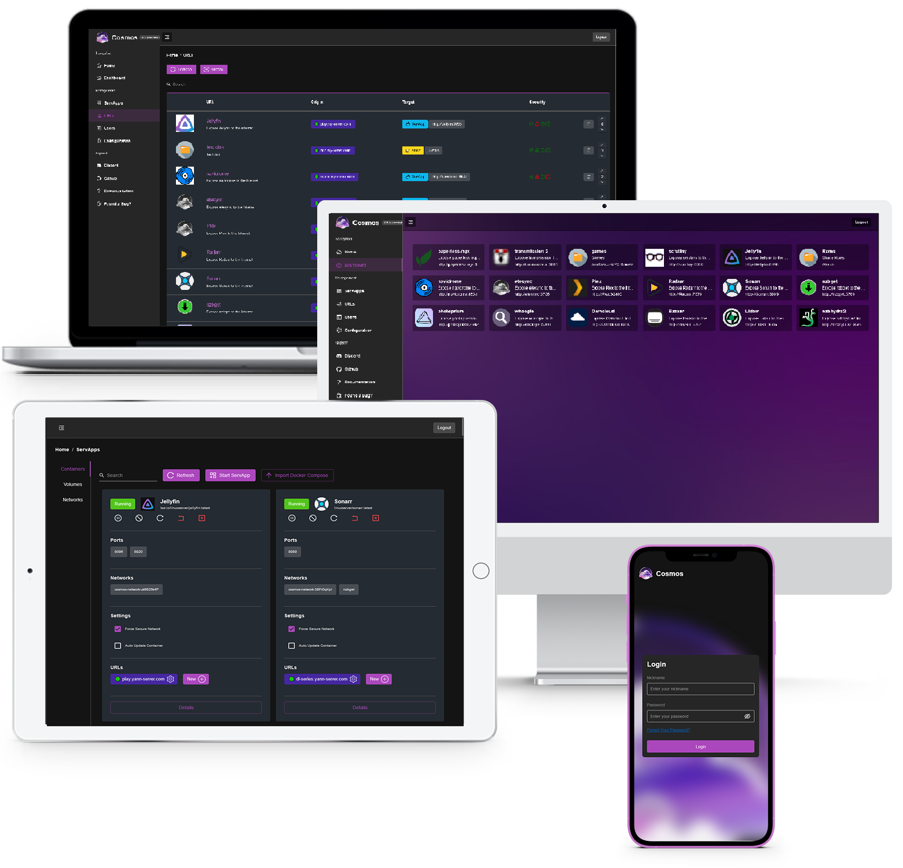
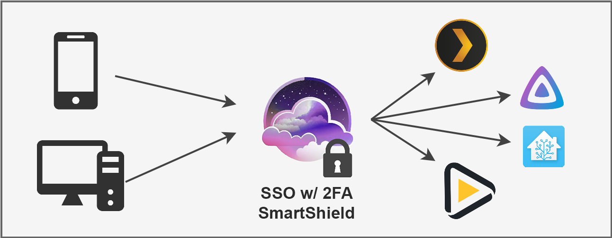

[](https://discord.gg/PwMWwsrwHA) 

# Cosmos Server

```
**Disclaimer**: Cosmos is still in early Alpha stage, please be careful when you use it. It is not (yet, at least ;p) a replacement for proper control and mindfulness of your own security.
```

Cosmos is a server platform for running self-hosted applications securely and with built-in privacy features. It combines a reverse proxy, an authentication provider, and an application manager to provide easy setup and robust security.  It aims to solve the increasingly worrying problem of vulnerable self-hosted applications and personnal servers by providing a secure gateway to access data without compromising on security.



Whether you have a **server**, a **NAS**, or a **Raspberry Pi** with applications such as **Plex**, **HomeAssistant** or even a blog, Cosmos is the perfect solution to secure it all. Simply install Cosmos on your server and connect to your applications through it to enjoy built-in security and robustness for all your services, right out of the box.

 * **Authentication** Connect to all your application with the same account, including strong security and **multi-factor authentication**
 * **Automatic HTTPS** certificates provision
 * **Anti-bot** protections such as Captcha and IP rate limiting
 * **Anti-DDOS** protections such as variable timeouts/throttling, IP rate limiting and IP blacklisting
 * **Proper user management** to invite your friends and family to your applications without awkardly sharing credentials. Let them request a password change with an email rather than having you unlock their account manually!

And a **lot more planned features** are coming!



**If you're a self-hosted application developer**, integrate your application with Cosmos and enjoy **secure authentication**, **robust HTTP layer protection**, **HTTPS support**, **user management**, **encryption**, **logging**, **backup**, and more - all with **minimal effort**. And if your users prefer **not to install** Cosmos, your application will **still work seamlessly**.

# Why use it?

If you have your own self-hosted data, such as a Plex server, or may be your own photo server, **you expose your data to being hacked, or your server to being highjacked**.

It is becoming an important **threat to you**. Managing servers, applications and data is **very complex**, and the problem is that **you cannot do it on your own**: how do you know that the photo  application's server where you store your family photos has a secure code?

Because every new self-hosted applications **re-invent the wheel** and implement **crucial parts** such as authentication **from scratch** everytime, the **large majority** of them are very succeptible to be **hacked without too much trouble**. On top of that, you as a user need to make sure you properly control the access to those applciation and keep them updated.

**Even a major application such as Plex** has been **hacked** in the past, and the data of its users has been exposed. In fact, the recent LastPass happened because a LastPass employee had a Plex server that **wasn't updated to the last version** and was missing an important **security patch**!

That is the issue Cosmos Server is trying to solve: by providing a secure and robust gateway to all your self-hosted applications, **you can be sure that your data is safe** and that you can access it without having to worry about the security of your applications.

# Installation

Installation is simple using Docker:

```
docker run -d -p 80:80 -p 443:443 -v /path/to/cosmos/config:/config azukaar/cosmos-server:latest
```

you can use `latest-arm64` for arm architecture (ex: NAS or Raspberry)

You can thing tweak the config file accordingly. Some settings can be changed before end with env var. [see here](https://github.com/azukaar/Cosmos-Server/wiki/Configuration).

# How to contribute

## Setup

You need [GuPM](https://github.com/azukaar/GuPM) with the [provider-go](https://github.com/azukaar/GuPM-official#provider-go) plugin to run this project.

```
g make
```

## Run locally

First create a file called dev.json with:

```json
{
  "MONGODB": "your mongodb connection string"
}
```

```
g build
g start # this will run server
g client # this will run the client
```
