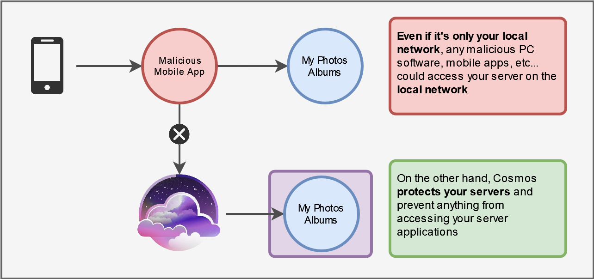
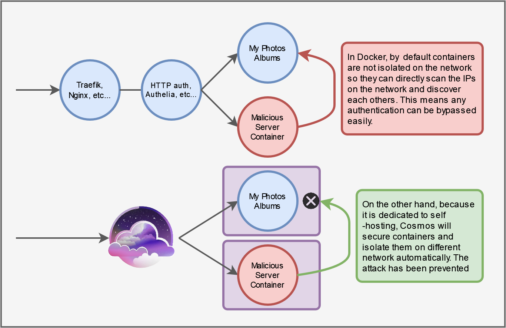

[](https://discord.gg/PwMWwsrwHA) 

# Cosmos Server

Cosmos is a self-hosted platform for running server applications securely and with built-in privacy features. It acts as a secure gateway to your application, as well as a server manager. It aims to solve the increasingly worrying problem of vulnerable self-hosted applications and personnal servers.


Whether you have a **server**, a **NAS**, or a **Raspberry Pi** with applications such as **Plex**, **HomeAssistant** or even a blog, Cosmos is the perfect solution to secure them all. Simply install Cosmos on your server and connect to your applications through it to enjoy built-in security and robustness for all your services, right out of the box.

 * **Secure Authentication** 👦👩 Connect to all your applications with the same account, including **strong security** and **multi-factor authentication**
 * **Latest Encryption Methods** 🔒🔑 To encrypt your data and protect your privacy. Security by design, and not as an afterthought
 * **Reverse Proxy** 🔄🔗 Reverse Proxy included, with a UI to easily manage your applications and their settings
 * **Automatic HTTPS** 🔑📜 certificates provisioning with Certbot / Let's Encrypt
 * **Anti-Bot** 🤖❌ protections such as Captcha and IP rate limiting
 * **Anti-DDOS** 🔥⛔️ protections such as variable timeouts/throttling, IP rate limiting and IP blacklisting
 * **Proper User Management** 🪪 ❎ to invite your friends and family to your applications without awkardly sharing credentials. Let them request a password change with an email rather than having you unlock their account manually!
 * **Container Management** 🐋🔧 to easily manage your containers and their settings, keep them up to date as well as audit their security.
 * **Modular** 🧩📦 to easily add new features and integrations, but also run only the features you need (for example No docker, no Databases, or no HTTPS)
 * **Visible Source** 📖📝 for full transparency and trust
 
And a **lot more planned features** are coming!


# Why use it?

If you have your own self-hosted data, such as a Plex server, or may be your own photo server, **you expose your data to being hacked, or your server to being highjacked** (even on your **local network**!).

It is becoming an important **threat to you**. Managing servers, applications and data is **very complex**, and the problem is that **you cannot do it on your own**: how do you know that the server application where you store your family photos has a secure code? it was never audited. 

**Even a major application such as Plex** has been **hacked** in the past, and the data of its users has been exposed. In fact, the recent LastPass leak happened because a LastPass employee had a Plex server that **wasn't updated to the last version** and was missing an important **security patch**!

That is the issue Cosmos Server is trying to solve: by providing a secure and robust way to run your self-hosted applications, **you can be sure that your data is safe** and that you can access it without having to worry about your security.

Here's a simple example of how Cosmos can help you:



Another example:



Additionally, because every new self-hosted applications re-implement **crucial systems** such as authentication **from scratch** everytime, the **large majority** of them are very succeptible to being **hacked without too much trouble**. This is very bad because not only Docker containers are not isolated, but they also run as **root** by default, which means it can **easily be used** to offer access to your entire server or even infrastructure.

Most tools currently used to self-host **not specifically designed to be secure for your scenario**. Entreprise tools such as Traefik, NGinx, etc... Are designed for different use-cases that assume that the code you are running behind them is **trustworthy**. But who knows what server apps you might be running? On top of that, a lot of reverse-proxies and security tools lock important security features behind 3 to 4 figures business subscriptions that are not realistic for selfhosting. 

If you have any further questions, feel free to join our [Discord](https://discord.gg/PwMWwsrwHA)!

```
Disclaimer: Cosmos is still in early Alpha stage, please be careful when you use it. It is not (yet, at least ;p) a replacement for proper control and mindfulness of your own security.
```

# As A Developer

**If you're a self-hosted application developer**, integrate your application with Cosmos and enjoy **secure authentication**, **robust HTTP layer protection**, **HTTPS support**, **user management**, **encryption**, **logging**, **backup**, and more - all with **minimal effort**. And if your users prefer **not to install** Cosmos, your application will **still work seamlessly**.

Authentication is very hard (how do you check the password match? What encryption do you use? How do you store tokens? How do you check if the user is allowed to access the application?). Cosmos Server provides a **secure authentication system** that can be used by any application, and that is **easy to integrate**.

# Installation

Installation is simple using Docker:

```
docker run -d -p 80:80 -p 443:443 --name cosmos-server --restart=always -v /var/run/docker.sock:/var/run/docker.sock -v /path/to/cosmos/config:/config azukaar/cosmos-server:latest
```

make sure you expose the right ports (by default 80 / 443). It is best to keep those ports intacts, as Cosmos is meant to run as your reverse proxy. Trying to setup Cosmos behind another reverse proxy is possible but will only create headaches.

you can use `latest-arm64` for arm architecture (ex: NAS or Raspberry)

You can thing tweak the config file accordingly. Some settings can be changed before end with env var. [see here](https://github.com/azukaar/Cosmos-Server/wiki/Configuration).

if you are having issues with the installation, please contact us on [Discord](https://discord.gg/PwMWwsrwHA)!
